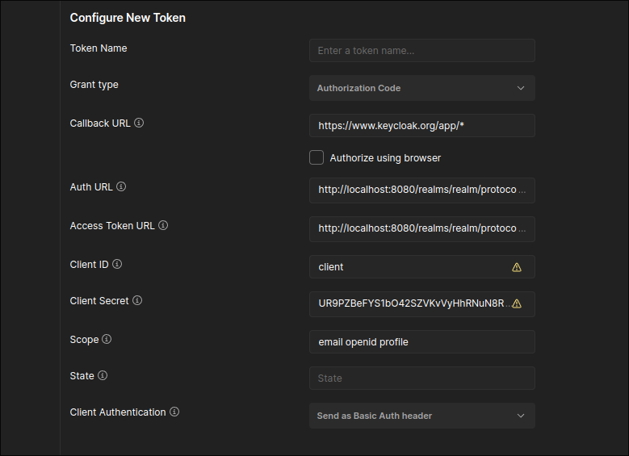

## ! This repository was forked from https://github.com/linksmart/thing-directory, I am only making custom changes on the code for academic usage, all credits to the authors.

# Thing Directory custom install

A priori, por convenção esta documentação estará presente em português, entretanto será disponibilizada em inglês ao fim do projeto.

Esse arquivo representa a instalção customizada do Thing-Directory, de acordo com a documentação de instalação padrão presente no README desse repositório, caso ache necessário direi para olhar a documentação dos autores, entretanto explicarei detalhes que não forem claros. Qualquer coisa, consulte a [documentação original](./README.md).

# Pré requisitos

Antes de rodar instale na sua máquina:

- [Go](https://go.dev/dl/)
   - For Ubuntu (18.04, 20.04, 22.04) users: https://go.dev/wiki/Ubuntu
   
- [Keycloak](https://www.keycloak.org/downloads) (pela aplicação em si \*necessário baixar o jdk para rodar\*, ou como um conteiner Docker *como você fez na sua instalação?*) 
   
- [Postman](https://www.postman.com/downloads/)
   [](./Captura%20de%20tela%20de%202024-05-08%2014-06-50.png)

# First steps

Primeiramente, clone esse repositório na sua máquina.

```git clone ```

Após isso, <i>build</i> apartir da root do projeto, execute para rodar, buildar pela configuração padrão do <i>Thing Directory</i>.

``` bash
    go build
    go run . --conf=sample_conf/thing-directory.json
```

Estes comandos iniciam o thing-directory com a configuração contida em `sample_conf/thing-directory.json`. No `sample_conf/thing-directory.json` de linksmart (https://github.com/linksmart/thing-directory/blob/master/sample_conf/thing-directory.json) 

```
...
"auth:": { 
  "enabled": false
  ...
```

Esta configuração permite acessar os recursos do diretório de coisas sem autorização. Um dos focos deste projeto é usar autorização o que implica em personalizar a configuração.

 Para personalizar a configuração, cria-se o diretório `conf`, copia-se o arquivo `thing-directory.json` e modifica-se esta cópia, como mostrado no fragmento de código logo em seguida.


Após isso, você deve ser capaz de inicializar a aplicação, feche-a por enquanto.

Note que ele utiliza o arquivo sample_conf como base para rodar inicialmente, entretanto o diretório padrão que a aplicação utiliza é denominado <b>conf</b>.

Ainda na root, execute:

``` bash
    mkdir conf
    cp ./sample_conf/thing-directory.json ./conf
```

*obs.:* O fork de narcisoleedev contém um diretório `conf` parcialmente configurado para usar como servidor de autorização o `keycloak` . <!-- Não sei se é o que já está no seu fork ou se quando executa o linksmart pela primeira vez ele cria o diretório `conf`  . Por que substituir o arquivo que já está no conf por esse do sample_conf? É ele que configura para autorizar os acessos locais? -->

Com isso você conseguirá executar o diretório de coisas utilizando `go run .`. Entretanto, o servidor está com as configurações todas desabilitadas, explicarei como habilitar cada parte:

## API

Antes de tudo, com a aplicação rodando já conseguimos verificar o funcionamento do Thing Directory, para isso usaremos o <b>Postman</b> para testar os endpoints.

Vale a pena ressaltar que a documentação da API está presente em [documentação](https://linksmart.eu/swagger-ui/dist/?url=https://raw.githubusercontent.com/linksmart/thing-directory/master/apidoc/openapi-spec.yml).

Entretanto, explicitarei alguns detalhes que podem não ser muitos claro. Usaremos o endereço 0.0.0.0 e a porta 8081 como padrão da aplicação.

Acessei a URL com o navegador, deu 405-Unauthorized. Sinal que está funcionando... . Mais tarde, com a ajuda de narcisoleedev, vi que o arquivo de configuração, inclusive de `sample_conf` foi ajustado para usar autorização. Restaurei o arquivo de configuração de linksmart e isso permitiu usar a API em conformidade com o mostrado abaixo.

Alguns os endpoints de <b>Registration API</b>:

ex: 

POST
- http://0.0.0.0:8081/things:

BODY 

```json
{
  "@context": "https://www.w3.org/2019/wot/td/v1",
  "title": "Smart Garden System",
  "description": "A garden system that automates watering based on soil moisture and weather predictions.",
  "properties": {
    "soilMoisture": {
      "type": "integer",
      "forms": [{
        "href": "http://192.168.1.108:8080/soilMoisture"
      }],
      "readOnly": true
    },
    "lastWatered": {
      "type": "string",
      "forms": [{
        "href": "http://192.168.1.108:8080/lastWatered"
      }],
      "readOnly": true
    }
  },
  "actions": {
    "waterPlants": {
      "forms": [{
        "href": "http://192.168.1.108:8080/waterPlants"
      }]
    }
  },
  "events": {
    "wateringCompleted": {
      "data": {"type": "boolean"},
      "forms": [{"href": "http://192.168.1.108:8080/events/wateringCompleted"}]
    }
  },
  "securityDefinitions": {
    "basic_sc": {
      "scheme": "nosec"
    }
  },
  "security": "basic_sc"
}
```

*obs.*: tanto get quanto post em 0.0.0.0:8081/things resulta em 401-Unauthorized. [captura GET](./Captura%20de%20tela%20de%202024-05-08%2014-24-50.png) [captura POST](./Captura%20de%20tela%20de%202024-05-08%2014-32-11.png).  Mais tarde, com a ajuda de narcisoleedev, vi que o arquivo de configuração, inclusive de `sample_conf` foi ajustado para usar autorização. Restaurei o arquivo de configuração de linksmart e isso permitiu usar a API 

Usando a configuração do serviço de diretório de coisas **sem autorização**, digitando na barra de endereço do navegador `http://0.0.0.0:8081/things` obtive a captura de tela abaixo:
	


GET/PUT/PATCH/DELETE 
- http://0.0.0.0:8081/things/{id}:

Dependendo do método HTTP, coloque no body nada (GET/DELETE) ou uma nova TD (PUT/PATCH).

Alguns os endpoints de <b>Search API</b>:

GET(JSONPATH)
- http://0.0.0.0:8081/search/jsonpath?query=$[?(@.title=='Fibaro Wall Plug')]

Retorna a TD com base nos parâmetros de procura.

GET(XPATH)
- http://localhost:8081/search/xpath?query=//*[title='Smart Lamp']/properties

Retorna a TD com base nos parâmetros de procura.

Leve em consideração que não habilitamos a autenticação ainda, portanto nada deve ser mandado no header.

### Validation

Para habilitar a validação, baixe o json padrão de validação da W3C em [link](https://www.w3.org/2022/wot/td-schema/v1.1).

Esse json apresenta uma série de padrões que uma Thing Description precisa ter para poder ser validada pelo Thing Directory.

Agora cole na pasta conf.

Com isso, modifique as seguintes linhas do *thing-direcory.json*:

```json
"validation": {
    "jsonSchemas": ["./conf/jsonSchema.json"]
  },
```

Rode a aplicação e veja se receba esse log:

```
Loaded JSON Schemas: [./conf/jsonSchema.json]
```

Agora, caso você insira uma TD fora dos padrões, você receberá resposta 401, caso esteja tudo certo 200 normalmente.

**nota**: no fork de narcisoleedev (e neste também) o diretório `conf` contém os arquivos que configuram o serviço de diretório de coisas para aplicar os critérios de validação.

### DNS/SD

Para maiores detalhes aconselha-se olhar a documentação original nessa parte, presente em [DNS-SD registration](https://github.com/linksmart/thing-directory/wiki/Discovery-with-DNS-SD).

Para habilitar o DNS/SD sem interfaces de publicação, modifique o *thing-direcory.json*, dessa maneira.

```json
"dnssd": {
    "publish": {
      "enabled": true,
      "instance": "LinkSmart Thing Directory",
      "domain": "local.",
      "interfaces": []
    }
  },
```

Com isso, você habilitará o DNS/SD na sua rede. Confirme rodando a aplicação e vendo o log:

```log
DNS-SD: registering as "LinkSmart Thing Directory._wot._tcp.local.", subtype: _directory
DNS-SD: publish interfaces not set. Will register to all interfaces with multicast support.
```
**nota**: no fork de narcisoleedev (e neste também) o diretório `conf` contém os arquivos que configuram o serviço de diretório de coisas para aplicar os critérios de validação.

### HTTP Config

Para fins de teste, não modifiquei as configurações de HTTP da aplicação, mas pode-se alterar normalmente os parâmetros iniciais de porta, endereço ou outro.

```json
"http": {
    "publicEndpoint": "http://fqdn-of-the-host:8081",
    "bindAddr": "0.0.0.0",
    "bindPort": 8081,
    "tls": {
      "enabled": false,
      "keyFile": "./tls/key.pem",
      "certFile": "./tls/cert.pem"
    },
```

### Autenticação

Essa parte deve-se prestar bastante atenção para habilitar a autenticação normalmente.

Primeiro baixe o keycloak e instale conforme a documentação na maneira que você queira instalar.

Para [*on bare metal*](https://www.keycloak.org/getting-started/getting-started-zip)

*** quando criar o cliente, habilite o cliente mo modo de desenvolvimento protegido***

Requisito: Keycloak usa openjdk-17. Isto obrigou-me a instalar diferentes versões de Java e um chaveador de versões. O comando para chaver versões é `sudo update-alternatives --config java` e `sudo update-alternatives --config javac`. A documentação em que me baseei é: https://linuxconfig.org/how-to-install-and-switch-java-versions-on-ubuntu-linux

Após todos os passos (ié instalar, criar o usuário administrador, criar o *realm* criar usuário e cliente do *realm*, sem modificar os nomes, ié, myrealm, myuser, myclient). O serviço de autorização está pronto para ser usado e é compatível com o serviço de diretório de coisas (note que em `conf/thing-directory.json temos:
	
```json
"auth": {
      "enabled": true,
      "provider": "keycloak",
      "providerURL": "http://localhost:8080/realms/myrealm",
      "clientID": "account",

```

OAuth é um protocolo de autorização baseado em *tokens* (https://auth0.com/intro-to-iam/what-is-oauth-2). Gerar uma requisição com *payload* (ié um POST) e token de autorização é facilitado pela aplicação Postman que pode ser baixada em https://www.postman.com/downloads/

Abra o Postman e faça uma requisição para o serviço de diretório *com token de autorização*. Por exemplo, selecione o tipo de requisição para GET, preencha a URL com 0.0.0.0:8081/things (URL do serviço de diretório de coisas); Na aba `authorization` (abaixo da URL) preencha os campos `callback URL` com https://www.keycloak.org/app/* , `auth URL` com http://localhost:8080/realms/myrealm/protocol/openid-connect/auth, `access token URL` com http://localhost:8080/realms/myrealm/protocol/openid-connect/token `Client ID` com myclient, `Scope` com email openid profile (as três palavras), role até o fim da aba de configuração de token e clique no botão `Get New Access Token`. Uma janela se abrirá, mostrando uma página do serviço de autorização (ié é uma página do keycloak local - url localhost:8081) para gerar o token mediante digitação de usuário e senha. Após digitar usuário e senha o token é gerado e pode ser copiado para a requisição no Postman. Este token tem validade de uma hora.

Após copiar o token para a requisição, clicar no botão send. Isto deve mostrar a resposta para a requisição, algo como o mostrado abaixo:
	


Para verificar os endpoints providos pelo cliente em questão (que no meu caso é chamado client, mas na documentação do keycloak é chamado myclient), acesse o seguinte endpoint: http://localhost:8080/realms/realm/.well-known/openid-configuration.

Pelos endpoints que recebemos de resposta, temos interesse no de autenticação e de *access token** 

- Auth URL: http://localhost:8080/realms/realm/protocol/openid-connect/auth
- Access Token URL: http://localhost:8080/realms/realm/protocol/openid-connect/token

Pegue também o secret do cliente que você criou pelo realm que você criou (pressupõe-se myrealm) e abra o painel de cliente e pegue o secret e coloque no campo Client ID.

Sua configuração deve ficar parecido com isso:

</img>

Após isso, com o Keycloak rodando, clique em Get Access New Token, faça a autenticação e cole o Access Token no campo solicitado.

Com isso antes de tudo, coloque a configuração de autenticação no jsonSchema.json.

```json
"auth": {
      "enabled": true,
      "provider": "keycloak",
      "providerURL": "http://localhost:8080/realms/realm",
      "clientID": "account",
      "basicEnabled": false,
      "authorization": {
```

Rode a aplicação e o Keycloak para testar a autenticação.

Após isso, se todos os passos foram seguidos, você deve receber a autorização e assim uma resposta 200.

### Deploy

*To be completed*


### Port Forwading

*To be completed*


